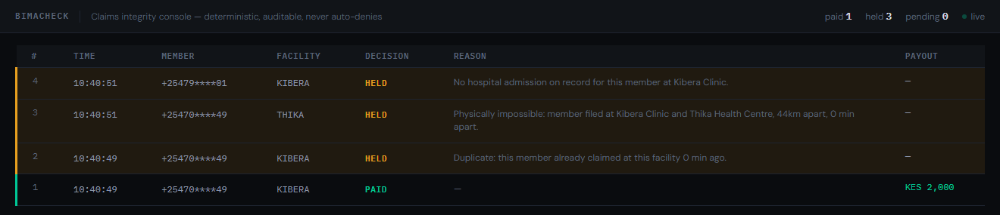

# BimaCheck — marketplace listing

Listing package for the Africa's Talking marketplace (marketplace.africastalking.dev). The AT marketplace lists applications built on AT APIs and requires a clear description, screenshots that match the features, and a clear onboarding process. This file holds all three, ready to paste into the listing form or present at the hackathon.

## Name

**BimaCheck** — deterministic hospi-cash claims integrity over USSD.

## One-line

File a hospi-cash claim from any phone over USSD. BimaCheck pays the valid ones straight to M-Pesa in seconds and holds the suspicious ones with a reason a human can read. It never auto-denies.

## Description

BimaCheck is a claims-integrity layer for hospi-cash insurance. A member files a claim over USSD, so no smartphone or app is needed. BimaCheck checks the claim against the member's hospital admission records and their recent claims, then either pays the benefit directly to their M-Pesa or holds it for review with a plain-language reason. Nothing is ever auto-denied, so no member is silently rejected by a black box. The insurer or SACCO watches every decision land on a live, auditable console.

It is built for micro-insurers, SACCOs, and hospi-cash schemes serving feature-phone users in Kenya and across East Africa, where the people most in need of cover are the least likely to own a smartphone.

## The problem it solves

Hospi-cash schemes bleed money to three common, boring frauds: duplicate claims on one admission, claims at a facility where the member was never admitted, and one member claiming at two hospitals too far apart to be real. Manual review is slow and the member waits. Smartphone-only insurtech leaves out the feature-phone majority entirely. BimaCheck catches the fraud with deterministic, auditable rules and pays the honest member fast, over the phone they already have.

## Why deterministic, on purpose

The decision that moves money runs on provable rules, not a model that could hallucinate a payout or a denial. Every hold carries the exact reason, in plain language, that a member or a regulator can read. In a moment where everything is becoming an AI agent, BimaCheck deliberately keeps the money path boring and auditable. That is a feature, not a limitation.

## Features

- **USSD claim intake** — works on any phone, no app.
- **Deterministic fraud engine** — three auditable rules (no admission on record, duplicate claim, geographically impossible claim, the last using haversine distance between facilities), evaluated in order.
- **Instant M-Pesa payout** — clean claims are paid via M-Pesa B2C in seconds.
- **Plain-language holds** — suspicious claims are held with a human-readable reason, never auto-denied. The member and the reviewer both see why.
- **Live insurer console** — every claim and decision, in real time (shown above).
- **SMS notifications** — the member is told whether the claim is paid or under review.

## Africa's Talking APIs used

- **USSD** — the claim intake channel.
- **SMS** — member notifications (approved / under review).
- Payout is over Safaricom M-Pesa Daraja B2C. **AT Voice** (reading the decision aloud to a feature-phone member) is on the roadmap.

## How it works

1. Member dials the USSD code and files a hospi-cash claim.
2. A background worker runs the fraud rules against the member's admissions and recent claims.
3. Clean claim: BimaCheck disburses the benefit to the member's M-Pesa and sends an approval SMS.
4. Suspicious claim: BimaCheck holds it and sends an SMS with the plain reason. A human reviews it. Nothing is auto-denied.
5. Every decision appears on the insurer console.

## Onboarding (how an insurer or SACCO goes live)

1. **Bring your data.** Provide your facility list (name and location) and your admissions source (which member was admitted at which facility). BimaCheck checks every claim against these.
2. **Point your channels at BimaCheck.** Set your Africa's Talking USSD callback and SMS callback to the BimaCheck endpoints.
3. **Add payout credentials.** Provide your M-Pesa Daraja B2C credentials to enable real disbursement, or run in review-only mode first with payouts off.
4. **Watch the console.** Claims and decisions appear live. Reviewers action the held claims.

## Live demo

https://173-255-232-5.ip.linodeusercontent.com — the console in the screenshot above is this URL, live.

## Status and roadmap

- Today: runs against the Africa's Talking and Daraja **sandbox**; the B2C request is accepted by Daraja and the full USSD -> decide -> pay/hold -> SMS pipeline works end to end.
- Next: AT Voice decision callback, a fourth claim-velocity rule, and production payout hardening (a runtime-generated Daraja security credential and a confirmed-payment state so a payout is only reported as paid once Safaricom confirms it). See `TODOS.md`.
